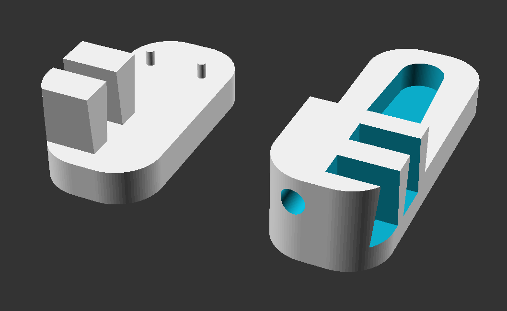

# compact-z-probe
A compact z-probe designed around an ultra subminiature switch with friction fit and separate contact point

This probe was designed around an ultra subminiature switch such as the OMRON
J-size D2F [D2F](https://www.components.omron.com/product-detail?partId=435)
series. The goals of this probe design were to utilize a very small switch for the
probe, use little to no additional hardware, and utilize a floating pin as a
contact point rather than the switch itself.

The scad is parameterized so you can adjust values for your own servo arm,
switch, and floating pin. The double dovetail should provide a good friction fit
with minimal filing or sanding.